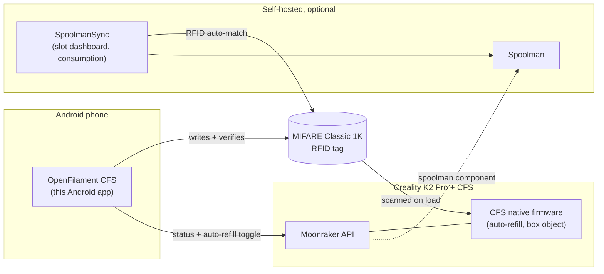

# OpenFilament CFS

**A native Android, local-first, open-source filament tagging and CFS management app for the Creality K2 Pro + CFS.**

Select a filament, confirm colour and spool size, then write and verify a real, CFS-compatible RFID tag — no cloud account, no proprietary accessory, no telemetry.

[](https://github.com/JohanGahnstrom/K2_pro/actions/workflows/android.yml)
[](LICENSE)
[](https://kotlinlang.org)
[](https://developer.android.com/tools/releases/platforms)
[](https://developer.android.com/tools/releases/platforms)
[](docs/BUILD_STATUS.md)

---

## Contents

- [Overview](#overview)
- [Architecture](#architecture)
- [Features](#features)
- [Project status — read this before you rely on it](#project-status--read-this-before-you-rely-on-it)
- [Repository layout](#repository-layout)
- [Getting started](#getting-started)
- [Documentation map](#documentation-map)
- [License](#license)
- [Third-party attribution](#third-party-attribution)
- [Independence](#independence)

## Overview

Creality's K2 Pro CFS (Cargo Feeding System) identifies filament spools via
encrypted RFID tags. Creality's own tags only exist for Creality-branded
filament — everyone else's spools show up unlabelled. OpenFilament CFS closes
that gap: it's a phone-in-hand tool that writes a real, verified,
CFS-compatible tag onto any third-party spool, so the printer treats it the
same way it treats a first-party one.

The product is split into two experiences:

- **Simple Mode** (default) — hides protocol data, material IDs, encryption
  and raw telemetry. Three choices: filament, colour, spool size.
- **Expert Mode** — exposes mapping evidence, technical field values and
  capability-gated printer tools behind explicit warnings.

The application never presents an unverified write or printer command as
safe merely because *some* community implementation exists — every write is
read back and compared, and every technical claim in this repo is tracked
against a real source (see [Documentation map](#documentation-map)).

## Architecture

The app is deliberately a **thin client**. It owns the one job only a
phone-in-hand can do — writing the physical tag — and defers everything
stateful or time-critical to the printer's own firmware or to an existing,
actively-maintained open-source service instead of reimplementing it.



Relay-on-runout, filament consumption accounting, slot dashboards and
low-stock alerts all run printer-side or in
[SpoolmanSync](https://github.com/gibz104/SpoolmanSync) — vendored in this
repo as a submodule (see [Repository layout](#repository-layout)) — rather
than inside the Android app. Full reasoning in
[`docs/FUNCTIONAL_DESCRIPTION.md`](docs/FUNCTIONAL_DESCRIPTION.md).

## Features

| Area | What it does |
|---|---|
| **Tag codec** | AES-128-ECB key derivation + payload encrypt/decrypt, a direct verified port of the community-published scheme, checked against a published golden vector (`CfsCodecTest.kt`) |
| **Device gate** | Refuses the write flow up front on phones whose NFC controller can't do MIFARE Classic — never fails mid-transaction |
| **NFC transaction** | Probe → security-state detection (factory-default vs. already CFS-secured) → write Blocks 4–6 → mandatory read-back verification → sector-trailer install path for blank tags |
| **In-app guides** | Step-by-step screens (not just docs) for scanning/writing a tag, physically applying a tag to a spool, and safely reusing or moving one — reachable from Home and from the Tag screen |
| **Printer status** | Moonraker `box` object parsing (per-slot material/colour/remaining-length/temperature), native auto-refill toggle, `M8200` load/unload, `M141` chamber command |
| **Local spool history** | Every verified write is recorded locally (product, colour, weight, serial, timestamp), removable per-entry, persisted across restarts |
| **Material catalogue** | 41 verified Creality material codes, replacing placeholder IDs |
| **UI** | Jetpack Compose + Material 3, Simple/Expert modes, edge-to-edge, dynamic colour |
| **Tests** | 34 unit tests (codec golden vector, device compatibility, write gating, serial stability, spool persistence, filament math) — see [`docs/BUILD_STATUS.md`](docs/BUILD_STATUS.md) for full CI history |

## Project status — read this before you rely on it

This project holds itself to a simple rule: never claim something is
verified unless it actually was. Right now:

- **Verified — compiles, lints, and passes all unit tests in real CI** on
  every push ([`.github/workflows/android.yml`](.github/workflows/android.yml))
  — real Gradle, real Android SDK, real GitHub Actions runners.
- **Verified — the cryptographic codec** is checked against a published
  golden vector, both in the standalone JVM harness used during development
  and in the shipped instrumented test.
- **Not yet verified — real hardware.** No real phone, no real tag, no real
  K2 Pro. Device compatibility, the actual tag write, and the printer
  integration are all built from community documentation and cryptographic
  proof, not a bench test. Tracked item-by-item in
  [`docs/HOLD_REGISTER.md`](docs/HOLD_REGISTER.md).
- **Not yet resolved — licensing of the ported codec.** See
  [License](#license) below; this is a real open item, not a footnote.
- **Not yet submitted anywhere.** No signing key, no store listing, no
  closed testing round yet ([`docs/PLAY_STORE_CHECKLIST.md`](docs/PLAY_STORE_CHECKLIST.md)).

In short: the software is solid and honestly documented; it has not yet met
a real spool.

## Repository layout

This repo holds the Android app at its root, plus the recommended companion
deployment as a git submodule:

- **`/`** — OpenFilamentCFS, the Android app (this README).
- **`/spoolmansync`** — [gibz104/SpoolmanSync](https://github.com/gibz104/SpoolmanSync)
  (MIT), pinned to real, verified upstream `main` (tag `v1.6.5`). A separate
  Next.js/Docker service, not linked into or built as part of the Android
  app — see [`docs/FUNCTIONAL_DESCRIPTION.md`](docs/FUNCTIONAL_DESCRIPTION.md)
  §11.1 for why slot dashboard/consumption/low-stock tracking live there
  instead of in the app.

  ```bash
  git clone --recurse-submodules <this-repo-url>
  # or, if already cloned:
  git submodule update --init --recursive
  ```

  A direct-Moonraker-mode feature (skip Home Assistant, talk straight to
  Moonraker) exists as a patch at
  [`docs/patches/spoolmansync-direct-mode.patch`](docs/patches/spoolmansync-direct-mode.patch)
  rather than as part of the pinned commit — see
  [`docs/patches/README.md`](docs/patches/README.md) for why and how to
  apply it to your own fork.

## Getting started

Open with a current Android Studio and install Android API 36. If the
Gradle wrapper JAR is absent, run `gradle wrapper --gradle-version 8.13`
once.

```bash
./gradlew testDebugUnitTest lintDebug assembleDebug bundleRelease
```

`testDebugUnitTest` includes `CfsCodecTest`, which must pass — it is the
gate described in `docs/FUNCTIONAL_DESCRIPTION.md` §8.4.

## Documentation map

| Document | What's in it |
|---|---|
| [`docs/FUNCTIONAL_DESCRIPTION.md`](docs/FUNCTIONAL_DESCRIPTION.md) | Full product spec, protocol details, and the reasoning behind every scope decision |
| [`docs/HOLD_REGISTER.md`](docs/HOLD_REGISTER.md) | Every open item blocking a real release, with what's needed to close each one |
| [`docs/SOURCE_REGISTER.md`](docs/SOURCE_REGISTER.md) | Every external source consulted, what was verified from it, and how |
| [`docs/BUILD_STATUS.md`](docs/BUILD_STATUS.md) | Real CI run history, including every failure this project has hit and how it was fixed |
| [`docs/PLAY_STORE_CHECKLIST.md`](docs/PLAY_STORE_CHECKLIST.md) | What's left before any public store submission |
| [`THIRD_PARTY.yml`](THIRD_PARTY.yml) | Per-file attribution for every piece of ported or referenced third-party work |

## License

OpenFilament CFS is licensed under the **GNU General Public License v3.0**
— see [`LICENSE`](LICENSE) for the full text.

**This does not automatically cover every file in this repository.** Two
files — [`nfc/CfsCodec.kt`](app/src/main/java/com/openfilament/cfs/nfc/CfsCodec.kt)
and [`data/MaterialCodes.kt`](app/src/main/java/com/openfilament/cfs/data/MaterialCodes.kt)
— are a direct port of code from
[flamebarke/creality_rfid](https://github.com/flamebarke/creality_rfid),
**which carries no LICENSE file in its upstream repository** (confirmed by
cloning the actual repository, not assumed). GPLv3 is this project's
license for the code it wrote; it is not a substitute for permission over
someone else's unlicensed work. **Do not redistribute this app publicly
(Play Store or otherwise) until this is resolved** — either by confirming
terms directly with the upstream author, or by re-deriving the codec
independently from the underlying cryptographic primitives rather than the
ported source. This is tracked as an open item, not swept under the rug.

## Third-party attribution

Full per-file detail lives in [`THIRD_PARTY.yml`](THIRD_PARTY.yml); this
table is a summary.

| Component | License | Role in this project |
|---|---|---|
| [flamebarke/creality_rfid](https://github.com/flamebarke/creality_rfid) | **No LICENSE file upstream — unresolved, see above** | Direct source of the AES codec, key-derivation scheme, payload layout and material-code table |
| [DnG-Crafts/K2-RFID](https://github.com/DnG-Crafts/K2-RFID) | Not specified upstream | Canonical origin project; not directly copied, recorded as provenance |
| [sybethiesant/CFSWriter](https://github.com/sybethiesant/CFSWriter) | Not specified upstream | Kotlin/Compose architecture reference only; no code copied |
| [gibz104/SpoolmanSync](https://github.com/gibz104/SpoolmanSync) | MIT | Vendored as the `/spoolmansync` git submodule; a separate deployment, not linked into the app |
| [Donkie/SpoolmanDB](https://github.com/Donkie/SpoolmanDB) | MIT | Planned filament catalogue ingestion source |
| [Donkie/Spoolman](https://github.com/Donkie/Spoolman) | Not directly copied | Consumption tracking is delegated here via Moonraker's `[spoolman]` component, not reimplemented |
| [ikarus23/MifareClassicTool](https://github.com/ikarus23/MifareClassicTool) | Not directly copied | Seed data for the device-compatibility allow/deny list |
| [HelixScreen K2-series docs](https://helixscreen.org/dev/printers/creality-k2/) | Documentation, not code | Source for the Moonraker `box` object schema and `M8200` command family |

Every entry above is traceable to a real commit or URL in
[`THIRD_PARTY.yml`](THIRD_PARTY.yml) and
[`docs/SOURCE_REGISTER.md`](docs/SOURCE_REGISTER.md) — nothing here is
inferred without a citation.

## Independence

OpenFilament CFS is not affiliated with or endorsed by Creality. "Creality,"
"K2 Pro" and "CFS" are used solely to describe hardware compatibility.
